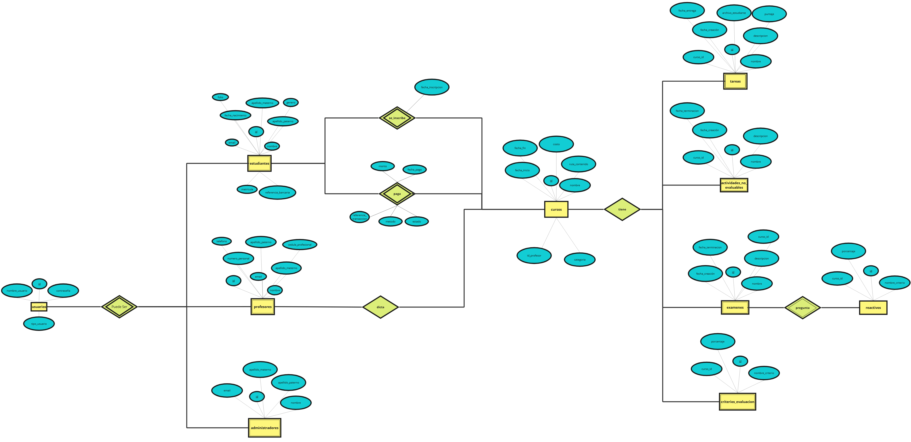
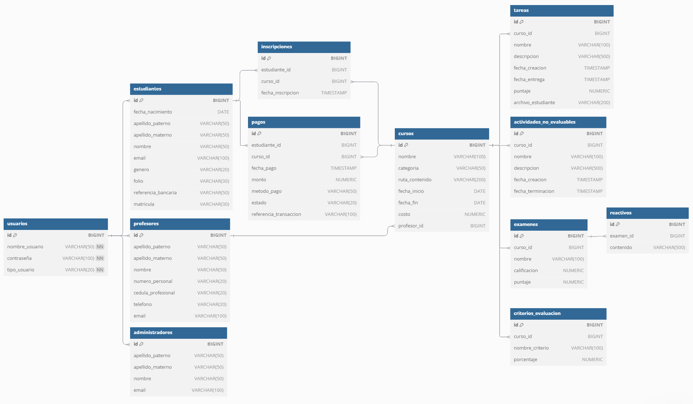

# 🗄️ TallerFinalBasesDatos

Proyecto final del curso de **Bases de Datos** que implementa el diseño y desarrollo de una base de datos para un **sistema de gestión de cursos en línea** (tipo Moodle/LMS).

## 📋 Descripción

Este repositorio contiene todos los recursos relacionados con la entrega del taller práctico final del curso de bases de datos. Incluye el diseño conceptual, lógico y físico de una base de datos para administrar cursos, estudiantes, profesores, tareas, exámenes y pagos en una plataforma educativa.

## ✨ Características del Sistema

- 👥 **Gestión de usuarios**: Estudiantes, Profesores y Administradores
- 📚 **Gestión de cursos**: Creación y administración de cursos con categorías
- 📝 **Actividades evaluables**: Tareas y exámenes con calificaciones
- 📋 **Actividades no evaluables**: Contenido complementario del curso
- 💳 **Sistema de pagos**: Registro de pagos e inscripciones
- 📊 **Criterios de evaluación**: Configuración de porcentajes por curso

## 🗂️ Estructura del Repositorio

```
TallerFinalBasesDatos/
├── DiagramaEntidadRelacion. png    # Diagrama E-R del modelo conceptual
├── DiagramaRelacional. png         # Diagrama del modelo relacional
├── TallerFinal. sql                # Script SQL completo de la base de datos
├── ProyectoFinalBD moodle v3 2024. pdf  # Documento del proyecto
└── README.md
```

## 🏗️ Modelo de Base de Datos

### Entidades Principales

| Entidad | Descripción |
|---------|-------------|
| **usuarios** | Tabla base para todos los tipos de usuarios del sistema |
| **estudiantes** | Información específica de estudiantes |
| **profesores** | Información específica de profesores |
| **administradores** | Información específica de administradores |
| **cursos** | Cursos disponibles en la plataforma |
| **tareas** | Actividades evaluables asignadas a cursos |
| **examenes** | Evaluaciones con calificación |
| **reactivos** | Preguntas de los exámenes |
| **actividades_no_evaluables** | Contenido complementario |
| **criterios_evaluacion** | Porcentajes de evaluación por curso |
| **inscripciones** | Registro de estudiantes en cursos |
| **pagos** | Transacciones de pago por cursos |

### Diagrama Entidad-Relación



### Diagrama Relacional



## 🛠️ Requisitos Previos

- **MySQL 8.0+** o **MariaDB 10. 5+**
- Cliente de base de datos (MySQL Workbench, DBeaver, HeidiSQL, phpMyAdmin, etc.)

## 🚀 Instalación y Configuración

### Paso 1: Clonar el repositorio

```bash
git clone https://github. com/WhiteRabbitCoder/TallerFinalBasesDatos.git
cd TallerFinalBasesDatos
```

### Paso 2: Crear la base de datos

Abre tu cliente de MySQL y ejecuta:

```sql
CREATE DATABASE IF NOT EXISTS taller_final_bd;
USE taller_final_bd;
```

### Paso 3: Ejecutar el script SQL

**Opción A - Desde línea de comandos:**
```bash
mysql -u tu_usuario -p taller_final_bd < TallerFinal.sql
```

**Opción B - Desde MySQL Workbench:**
1. Abre MySQL Workbench
2.  Conecta a tu servidor MySQL
3.  Abre el archivo `TallerFinal. sql`
4.  Ejecuta el script completo (Ctrl + Shift + Enter)

**Opción C - Desde phpMyAdmin:**
1.  Accede a phpMyAdmin
2. Selecciona la base de datos creada
3. Ve a la pestaña "Importar"
4. Selecciona el archivo `TallerFinal.sql`
5. Haz clic en "Continuar"

## 📊 Datos de Prueba Incluidos

El script SQL incluye datos de ejemplo para probar el sistema:

| Tipo de Usuario | Ejemplos |
|-----------------|----------|
| Estudiantes | jdoe, asmith, bwayne, ckent, dprince, hpotter, rgranger, hgranger, fweasley, gmalfoy |
| Profesores | eallen, y otros...  |
| Administradores | Incluidos en el script |

> ⚠️ **Nota**: Las contraseñas de prueba son `password123` para todos los usuarios.  En un entorno de producción, se deben usar contraseñas hasheadas. 

## 🔧 Tecnologías Utilizadas

- **MySQL** - Sistema de gestión de base de datos relacional
- **SQL** - Lenguaje de consulta estructurado
- **Modelo E-R** - Diseño conceptual de la base de datos
- **Modelo Relacional** - Diseño lógico normalizado

## 📝 Contenido del Script SQL

El archivo `TallerFinal.sql` contiene:

1. ✅ Creación de todas las tablas con sus restricciones
2.  ✅ Definición de claves primarias y foráneas
3.  ✅ Relaciones entre entidades con ON UPDATE CASCADE
4. ✅ Inserción de datos de prueba
5. ✅ Tipos de datos apropiados para cada campo

## 📚 Propósito Educativo

Este proyecto fue desarrollado como práctica para:

- 📖 Aplicar conceptos de diseño de bases de datos
- 🔗 Implementar relaciones entre entidades
- 📐 Crear diagramas E-R y relacionales
- 💾 Escribir scripts SQL para DDL y DML
- 🏛️ Comprender la normalización de datos

## 📄 Documentación

Para más detalles sobre los requerimientos del proyecto, consulta el archivo:
- [ProyectoFinalBD moodle v3 2024.pdf](ProyectoFinalBD%20moodle%20v3%202024%20.pdf)

## 👤 Autor

**WhiteRabbitCoder**

- GitHub: [@WhiteRabbitCoder](https://github.com/WhiteRabbitCoder)

## 📜 Licencia

Este proyecto es de código abierto y está disponible para fines educativos. 

---

⭐ Si este proyecto te fue útil, considera darle una estrella en GitHub. 
